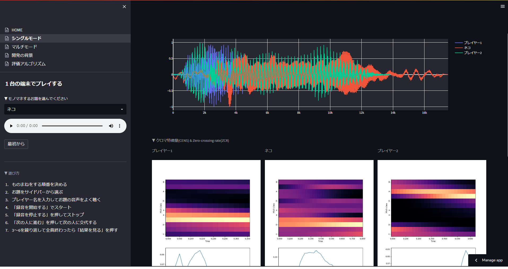

# ぽいネ！ (PoiNe!)


This is an application that automatically scores your mimics.

# DEMO

[](https://kitsuya0828-inpersonation-app-home-aaa1x7.streamlitapp.com/)



# Features

* Extract features (**CENS** and **ZCR**) from the theme's audio and your imitation, and caculate similarity by **[Fast Derivative DTW](https://github.com/z2e2/fastddtw)**.
* Compete with your online friends in real-time by participating with a common ID (Session state management with **Firebase**).

# Requirement

* Python 3.10.1
* [Firebase](https://firebase.google.com/)

# Installation & Usage

```bash
git clone https://github.com/Kitsuya0828/Inpersonation-App.git
cd Inpersonation-App
pip install -r requirements.txt
streamlit run HOME.py
```


# Note

If you want to use Firebase in a multi-mode implementation, please create `secrets.toml` in `.streamlit/` folder directly under the directory. Then write the service account key issued by Firebase in TOML format in the file.

Service account keys are issued in JSON format, but the following site is recommended to convert them to TOML format.

[Convert JSON to TOML Online \- ConvertSimple\.com](https://www.convertsimple.com/convert-json-to-toml/)

```bash
mkdir .streamlit
cat path/to/serviceAccountKey.toml > .streamlit/secrets.toml
```

The following site is also helpful to know how to manage secrets in Streamlit.

[Secrets management \- Streamlit Docs](https://docs.streamlit.io/streamlit-cloud/get-started/deploy-an-app/connect-to-data-sources/secrets-management)

# Author

* Kitsuya Azuma  ( kitsuyaazuma@gmail.com )
* Hiroki Aita
* Tohoku University


# License

"PoiNe!" is under [MIT license](https://en.wikipedia.org/wiki/MIT_License).


Thank you!